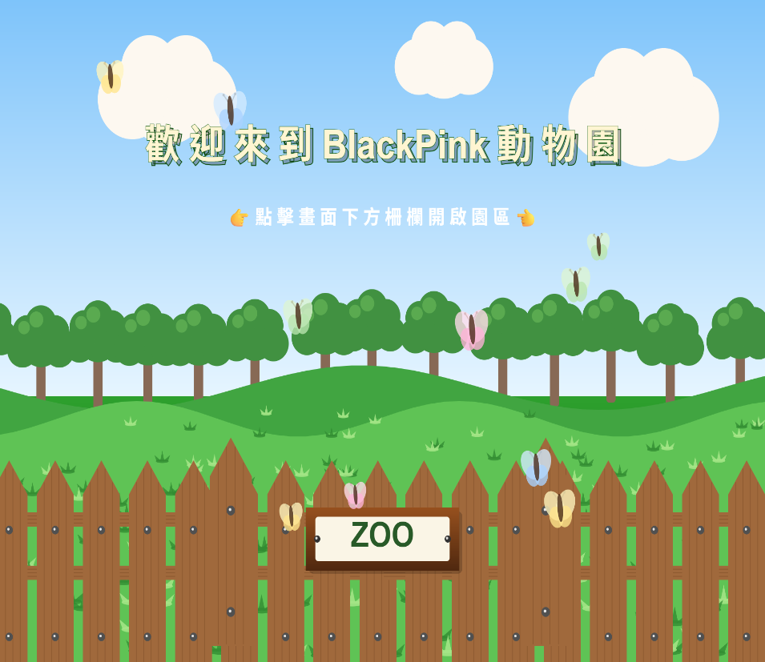
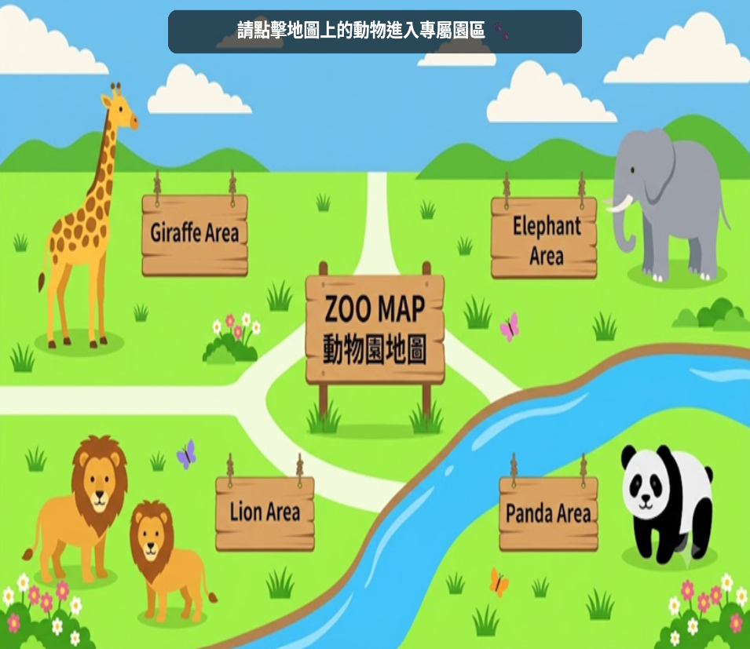
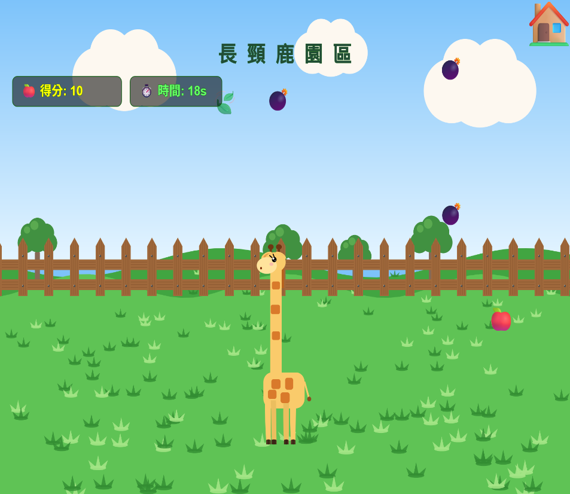

# p5js-interactive-zoo
An interactive virtual zoo with mini-games created using p5.js.
# Interactive Zoo

An interactive virtual zoo with mini-games created using p5.js.

「BlackPink 動物園」是互動媒體課程的團隊期末作品。
使用者可以透過滑鼠點擊進入虛擬動物園，並利用地圖前往不同動物園區，
體驗長頸鹿、獅子、大象與熊貓等不同互動內容與小遊戲。

Live Demo:  
https://dorishsuan0719.github.io/p5js-interactive-zoo/

---

## Project Preview

### Zoo Entrance

### Zoo Map

### Mini Game

---

## Project Overview

本作品以虛擬動物園作為互動場景，
將 p5.js 動畫、滑鼠互動、遊戲流程與聲音效果整合在同一個網頁作品中。

使用者可以先從動物園入口進入園區，
再透過地圖選擇不同動物區域，
每個區域具有不同的互動方式與遊戲規則。

作品主要希望透過遊戲化方式，
讓使用者在操作與探索的過程中體驗不同形式的人機互動。

---

## Mini Games

### Giraffe Feeding Challenge

長頸鹿園區提供餵食互動，
玩家需要在限定時間內完成指定操作，
並透過計分與倒數機制增加遊戲挑戰性。

### Lion Survival Challenge

獅子園區以生存挑戰為主要玩法，
玩家需要在遊戲時間內進行操作並避免失敗，
系統會即時顯示剩餘時間。

### Elephant Area

大象園區包含餵食與補水等互動任務，
玩家可透過不同操作完成大象照護相關目標。

### Panda Challenge

熊貓園區透過互動任務改變熊貓的幸福度，
玩家需要完成指定操作，
並觀察畫面上的狀態變化。

---

## Features

- Interactive zoo entrance
- Clickable zoo map
- Multiple animal areas
- Four different interactive mini-games
- Score and timer systems
- Game state management
- Background music and sound effects
- Animated visual elements
- Replay functions
- Return-to-map navigation

---

## Technologies

- JavaScript
- p5.js
- p5.sound
- HTML
- CSS

---

## Implementation

The project uses p5.js to draw the zoo environment and interactive elements.

Different game states are controlled through JavaScript variables and functions,
allowing the system to switch between the zoo entrance, map, game introduction,
gameplay, and result states.

Mouse interaction is used for entering the zoo,
selecting animal areas, and performing game actions.

Audio files are also integrated to provide different background music
and sound effects for each animal area.

---

## My Contribution

This project was developed as a team project for an Interactive Media course.

My contribution included modifying and integrating parts of the interactive zoo functions,
as well as participating in the development of the non-interactive visual project.

---

## Project Files

- `index.html` - Web page structure
- `sketch.js` - Main p5.js program
- `style.css` - Page styling
- `map.png` - Zoo map image
- `.mp3` files - Background music and sound effects

---

## Team Project

Interactive Media Course Final Project  
Developed by YuHsuan Chen and team.
